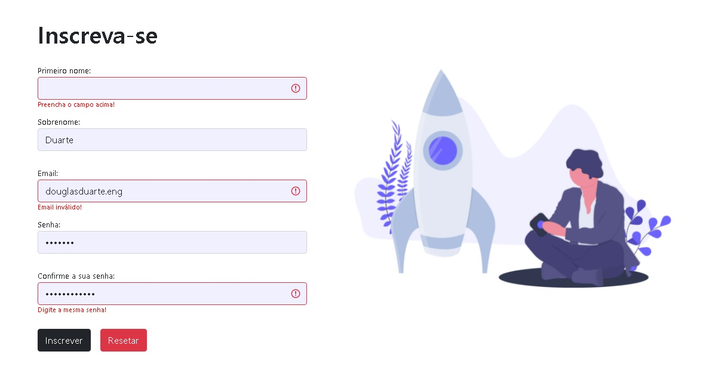

<h1 align="center">
  Formulário com validação
</h1>
</h1>

  <a href="#-tecnologias">Tecnologias</a>&nbsp;&nbsp;&nbsp;|&nbsp;&nbsp;&nbsp;
  <a href="#-projeto">Projeto</a>&nbsp;&nbsp;&nbsp;|&nbsp;&nbsp;&nbsp;
  <a href="#memo-licença">Licença</a>&nbsp;&nbsp;&nbsp;|&nbsp;&nbsp;&nbsp;

 

  

## 🚀 Tecnologias

Esse projeto foi desenvolvido com as seguintes tecnologias:

-   HTML
-   CSS
-   JavaScript
-   React.js

Utilitários

-   [Bootstrap](https://react-bootstrap.github.io/)
-   [Formik](https://formik.org/docs/overview)
-   [Yup](https://github.com/jquense/yup)

## 💻 Projeto

Formulario desenvolvido com React.js utilizando Bootstrap, Formik e Yup para validação.

## 📝 Licença

Esse projeto está sob a licença MIT.
